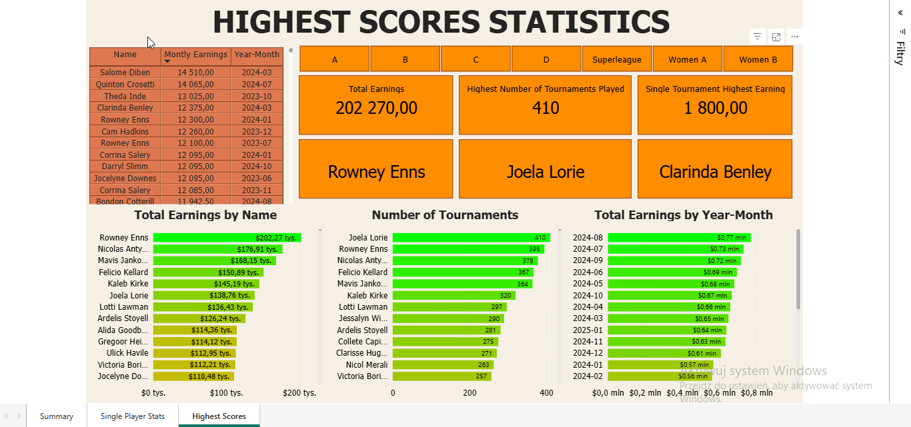

# 🏓 Power BI Dashboard – Table Tennis Tournament Statistics

Power BI dashboard presenting **detailed statistics of table tennis tournaments** across various leagues and time periods. This project provides both a high-level overview and deep insights into individual player performance and record-breaking results.

---

## 📊 Dashboard Overview

The report is divided into **three interactive pages**, each focusing on a different aspect of the data:

### 1. 📌 *Summary Statistics*

**Purpose**: Present general statistics aggregated across all tournaments.

#### Key Features:
- 🗓 **Time filters**: Select by month and year (e.g. March 2024) for dynamic filtering.
- 📈 Total metrics:
  - **Total Tournaments**
  - **Total Players**
  - **Total Matches** 
  - **Total Earnings**
- 📊 Table & bar chart showing:
  - Number of tournaments, matches, and earnings **by league** (A, B, C, D, Superleague, Women A, Women B)

---

### 2. 👤 *Single Player Statistics*

**Purpose**: Provide a personalized overview for any selected player.

#### Key Features:
- 🔍 **Search bar**: Enter a player's name to filter stats (e.g. "Tedmund Dempsey")
- 📆 First and last tournament dates
- 🏆 **Best month** (earnings & tournaments)
- 📊 Tournament and match breakdown by league
- 📈 Charts:
  - **Monthly tournament participation**
  - **Monthly earnings**  
- 📌 Averages:
  - Average monthly earnings (active & total)
  - Average number of tournaments per month

---

### 3. 🏆 *Highest Scores Statistics*

**Purpose**: Showcase the **record-holders** across all metrics.

#### Key Features:
- 🥇 Highest **single-month earnings**
- 📊 Bar charts:
  - Total earnings by player
  - Number of tournaments by player
  - Monthly aggregated earnings
- 🧠 Highlighted record-holders:
  - 🧾 Most tournaments played
  - 💰 Highest total earnings
  - 🏅 Highest single tournament earning

---

## 🧰 Technologies Used

- **Power BI Desktop**
- Power Query (ETL)
- DAX for calculated columns and measures
- Interactive slicers and filters
- Custom color themes for clear league distinction

---

## **Author**
Created by Rafał Zajkowski.
