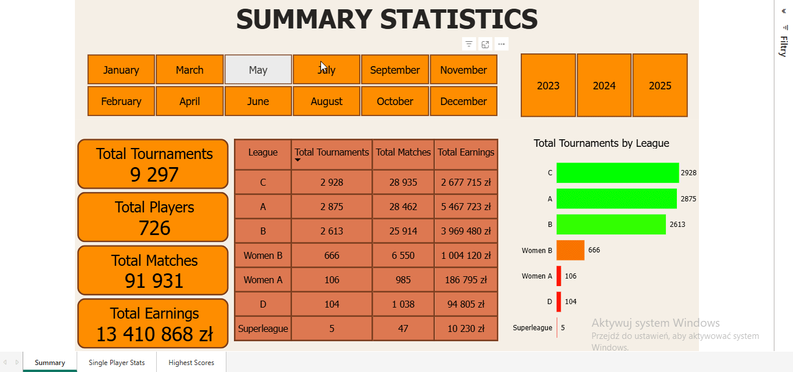
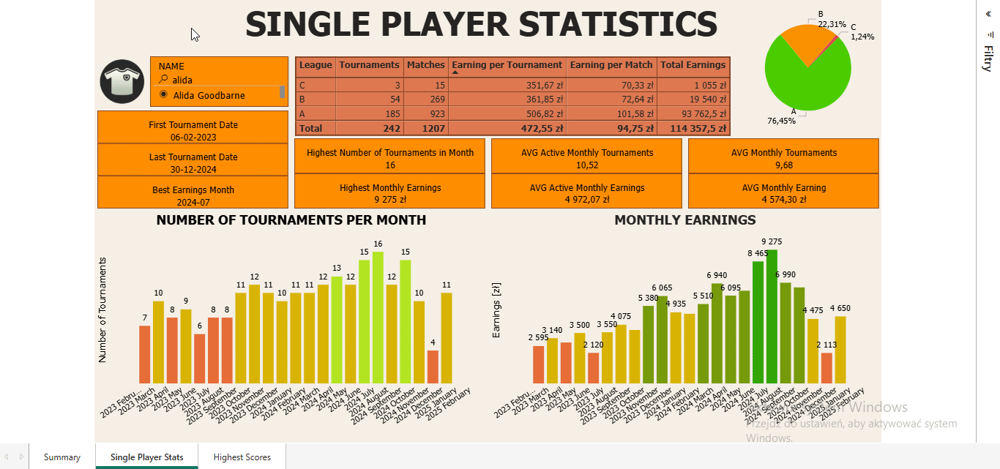
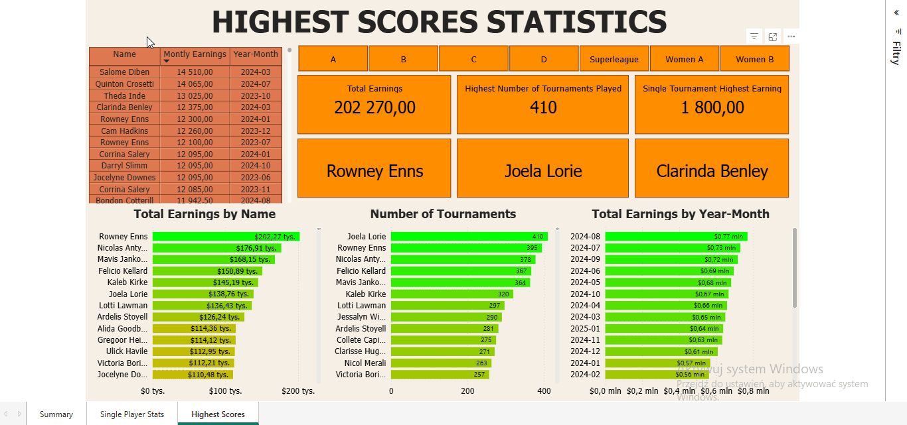

# 🏓 Dashboard Power BI – Statystyki Turniejów Tenisa Stołowego

Ten projekt to interaktywny dashboard wykonany w **Power BI**, prezentujący **szczegółowe statystyki turniejów tenisa stołowego**. Dane obejmują zarówno ogólne podsumowania, jak i wyniki pojedynczych zawodników oraz rekordowe osiągnięcia.

---

## 📊 Przegląd Raportu

Dashboard składa się z **trzech stron**, z których każda skupia się na innym aspekcie danych:

### 1. 📌 Statystyki Ogólne – *Summary Statistics*

**Cel**: Przedstawienie zbiorczych danych na temat wszystkich rozegranych turniejów.

#### Główne funkcjonalności:
- 🗓 Możliwość filtrowania danych po **miesiącu** i **roku** (np. *Lipiec 2024*)
- 📈 Podstawowe wskaźniki:
  - **Liczba turniejów**
  - **Liczba zawodników** 
  - **Liczba meczów** 
  - **Łączne zarobki**
- 📊 Tabela i wykres słupkowy prezentujące dane:
  - Liczba turniejów, meczów i zarobków **według ligi** (A, B, C, D, Superleague, Women A, Women B)

---

### 2. 👤 Statystyki Zawodnika – *Single Player Statistics*

**Cel**: Szczegółowa analiza danych dotyczących pojedynczego zawodnika.

#### Główne funkcjonalności:
- 🔍 **Wyszukiwarka**: Wpisz imię i nazwisko zawodnika (np. *Tedmund Dempsey*)
- 🏓 Informacje ogólne:
  - Data pierwszego i ostatniego turnieju  
  - Najlepszy miesiąc pod względem zarobków i liczby turniejów
- 📋 Statystyki według ligi:
  - Liczba turniejów, meczów, średnie zarobki na turniej i mecz
- 📈 Wykresy:
  - **Liczba turniejów w miesiącach**
  - **Zarobki miesięczne**
- 📊 Średnie wartości:
  - Średnia liczba turniejów miesięcznie (ogólna i aktywna)
  - Średnie zarobki miesięczne (ogólne i aktywne)

---

### 3. 🏆 Rekordy – *Highest Scores Statistics*

**Cel**: Wyróżnienie rekordowych osiągnięć zawodników.

#### Główne funkcjonalności:
- 🏅 Najwyższe wyniki:
  - 💰 Najwyższy miesięczny zarobek
  - 🧾 Najwięcej rozegranych turniejów
  - 🧍‍♂️ Najwyższe zarobki ogółem
  - 🎯 Największy zarobek w pojedynczym turnieju:
- 📊 Wykresy:
  - Zarobki ogółem wg zawodnika
  - Liczba turniejów wg zawodnika
  - Łączne zarobki wg miesiąca

---

## 🧰 Wykorzystane Technologie

- **Power BI Desktop**
- **Power Query** do przetwarzania i transformacji danych
- **DAX** do obliczeń i tworzenia miar
- Interaktywne **slicery**, filtry, tabele i wykresy
- Spójna kolorystyka ułatwiająca analizę danych

---

## **Autor**
Stworzony przez Rafał Zajkowski.
